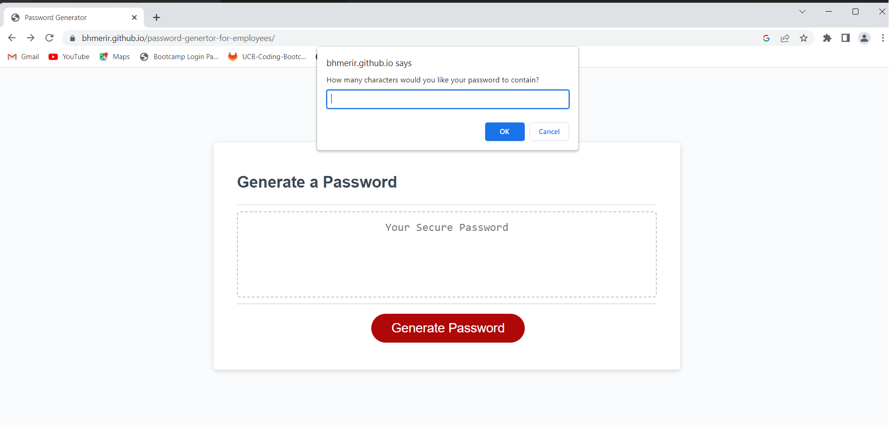

# Password Generator for Employees

The importance of keeping the personal data safe is not a secret these days. That is why lots of people around the world try to choose a secure password to keep intact their information from hackers and other intruders. This application generates a secure password for the employees of the companies and also for everyone who cares about their informatic security. 


<br>
In order to achieve this goal, I took the following steps:

<br>

1. ask the user to choose the number of the characters which they want their password consists of

2. ask their considered critia for password such as using uppercase characters, lowercase characters, special characters or numbers

3. generate a random password out of the user's selected options

<br>

<br>


## Mock-up

---------------------------------



<br>

<br>


## Some parts of code which are challenging and instructive

---------------------------------

1. This is a function which shuffles the list of the chosen characters to be more random.

    ```
    function shuffleList(){
        var listLength = chosenList.length;
        for(var i = 0; i < listLength; i++){
            var j = Math.floor(Math.random() * listLength);
            var temp = chosenList[i];
            chosenList[i] = chosenList[j];
            chosenList[j] = temp;
        }
    }
    ```

2. This function takes a list and a number of characters which are supposed to be chosen as input, and randomly selects and adds them to a new list.

    ```
    function selectAndAddChosenChars(charList, charNo){ 
        var selectedIndex = 0;
        var selectedChar = "";
        for (i = 0; i < charNo; i++){
            selectedIndex = Math.floor(Math.random() * charList.length);
            selectedChar = charList[selectedIndex];
            chosenList.push(selectedChar);
        }
    }
    ```

br>

<br>

## The used technologies  

---------------------------------

|      Technologies     |
|-----------------------|
|         HTML          |
|         CSS           |
|        JavaScript     |
|         Git           |

<br>

<br>


## The link of deployed site

---------------------------------

[https://bhmerir.github.io/password-genertor-for-employees](https://bhmerir.github.io/password-genertor-for-employees)

<br>

<br>

## Credits

---------------------------------

Name:    Bahareh Hosseini

Github page:      [https://github.com/Bhmerir](https://github.com/Bhmerir)

<br>

<br>

## License

---------------------------------

Distributed under the MIT License. See LICENSE.txt for more information.


